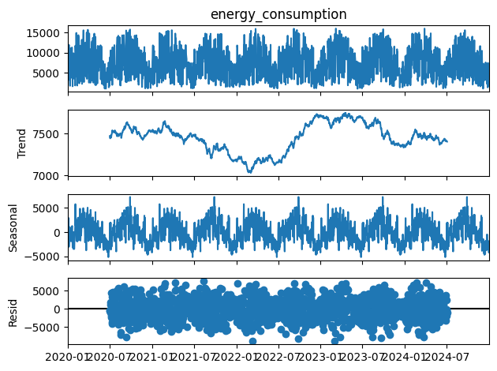
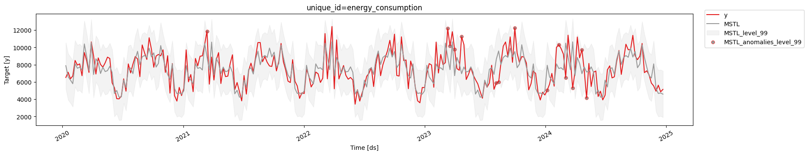
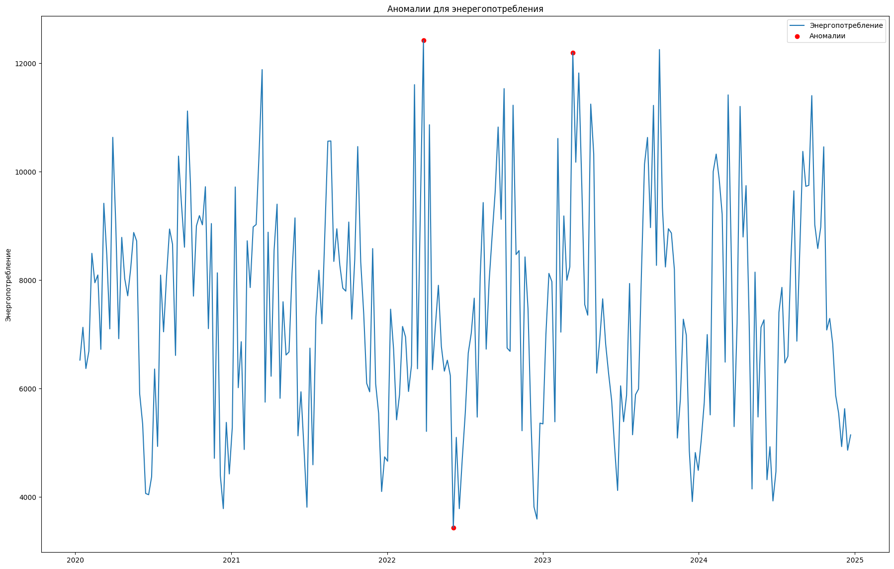
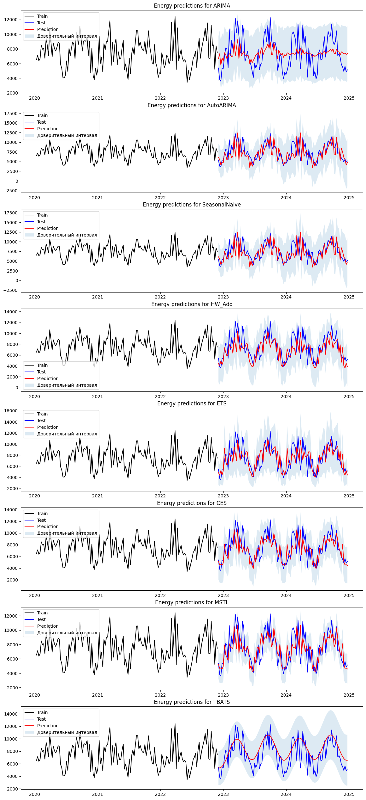
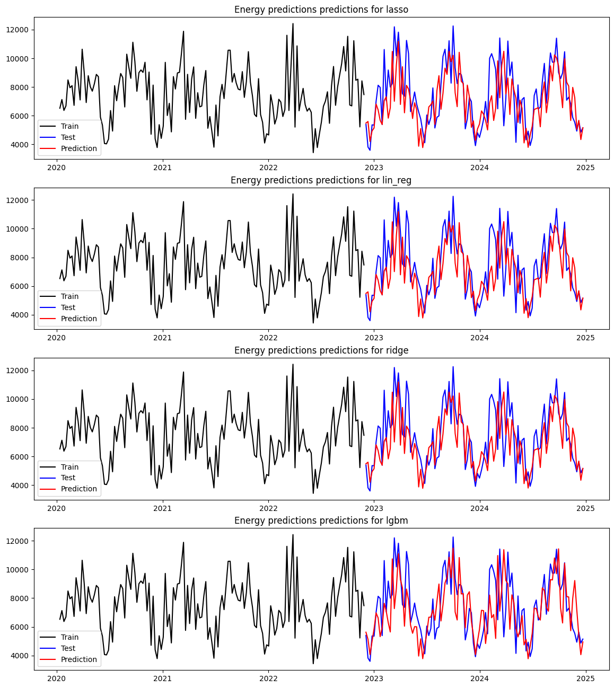
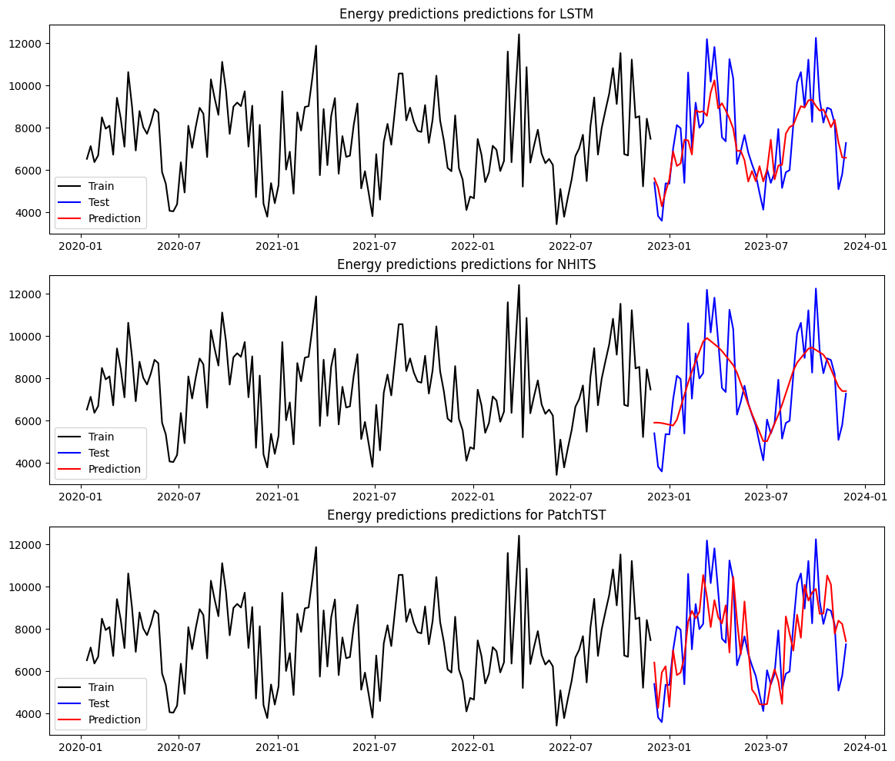
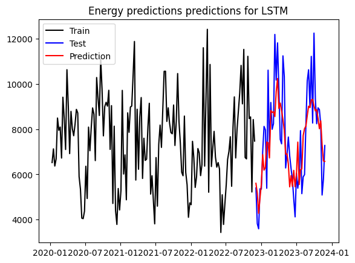

# melekhin-time-series
Репозиторий для курса "Анализ временных рядов". Мелехин Николай Сергеевич РИМ-150903

# 1. Описание ВР
- Датасет: временной ряд с экологическим, энерегетическими и экономическими факторами для Зимбабве - https://data.world/tadiwachawatama/energyclimatezimbabwe.
- Целевая переменная: energy_consumption - объем потребления энергии в сутки
- Период: ежедневно с 1.1.2020 до 31.12.2024
- Метрики: MAE, SMAPE, MASE, RMSE

# 2. Постановка задачи
Задача: построить прогноз потребления энергии на следующий год.

# 3. EDA ВР
EDA выполнен в task_1_timeseries.ipynb

Результаты:

| Признак | Результат |
| --- | --- |
| Количество наблюдений | 1826 |
| Пропуски | 0 |
| Дубликаты | 0 | 
| Монотонность | Монотонный |
| Сезонность | Годовая (52 недели) |
| Тренд | Непостоянный, пик в 2023 году |
| Значимые экзогенные факторы | avg_temperature, humidity, urban_population, energy_price |

# 4. Аномалии

Использовались три метода, код присутствует в task_3_timeseries.ipynb

| Метод | Описание | Результаты |
| ----- | -------- | ---------- |
| Вероятностное предсказание | Использутся MSTL модель для обнаружения аномалий. Параметры: levels = [99], MSTL(season_length=[SEASON]) | ['2021-03-14', '2023-03-12', '2023-03-19', '2023-04-02', '2023-04-23', '2023-08-06', '2023-08-13', '2023-10-01', '2024-01-07', '2024-02-11', '2024-03-03', '2024-03-24', '2024-04-21', '2024-05-05'] |
| Isolation Forest | Алгоритм обучения без учителя, работающий по принципу изоляции аномалии. Параметры: contamination=0.01, lags=[26] | ['2022-03-27', '2022-06-05', '2023-03-12']
| IQR | Простое обнаружение аномалии. Аномалиями считаются значения ниже Q1-1,5xIQR или выше Q3+1,5xIQR (Q1 - первый квантиль, Q3 - третий квантиль, IQR = Q3 - Q1) | Аномалии не обнаружены |

Методы обнаружения аномалий определили одну общую аномалию - '2023-03-12'. Так как аномалий не обнаружно много в целом и обнаружена лишь одна общая двумя методами, то оставляем их в датасете.

# 5. Методы анализа ВР

## Статистические методы

Статистические методы рассмотрены в task_2_timeseries.ipynb

| Модель | MAE | MASE | RMSE | SMAPE | Параметры | Комментарий |
| ------ | --- | ---- | ----- | ---- | --------- | ----------- |
| MSTL | 1234.35 | 0.84 | 1602.45 | 0.08 | season_length=SEASON | Выполняет множественную сезонную декомпозицию временного ряда с последующим прогнозированием каждой компоненты |
| AutoCES | 1264.20 | 0.86 | 1668.26 | 0.08 | season_length=SEASON | Автоматический подбор CES |
| ARIMA | 1265.17 | 0.87 | 1613.99 | 0.08 | (order=(4,0,3), seasonal_order=(1, 0, 0)) | ARIMA с ручными параметрами, подобранными на основе ACF и PACF графиков. Использует экзогенные факторы |
| TBATS | 1304.56 | 0.89 | 1600.69 | 0.09 | season_length=SEASON, use_damped_trend=True | Экспоненциальное сглаживание с преобразованием Бокса — Кокса, ARMA ошибками, трендом и сезонностью. use_damped_trend=True - затухающий тренд. |
| AutoETS | 1372.84 | 0.94 | 1724.00 | 0.09 | season_length=SEASON, model='ZZA' | Автоматический подбор ETS. Z - авто выбор ошибки и тренда, A - аддитиваная сезонность |
| HoltWinters | 1428.86 | 0.98 | 1788.84 | 0.10 | season_length=SEASON, error_type="A" | Тройное экспоненциальное сглаживание. A - аддитивная ошибка |
| SeasonalNaive | 1514.53 | 1.04 | 1989.30 | 0.10 | season_length=SEASON | Бейзлайн |
| AutoARIMA | 1544.20 | 1.06 | 2037.76 | 0.10 | season_length=SEASON | ARIMA с автоматическим подбором параметров. С экзогенными факторов. |

Выводы:
- MSTL показывает лучшие результаты. 
- Использование экзогенных факторов улучшает результаты ручной ARIMA, но такой подход все равно уступает некоторым подходам без их использования.

## ML методы

ML методы рассмотрены в task_3_timeseries.ipynb

| Модель | MAE | MASE | RMSE | SMAPE | Параметры | Комментарий |
| ------ | --- | ---- | ----- | ---- | --------- | ----------- |
| Lasso | 1361.49 | 0.93 | 1740.67 | 0.09 | - | Линейная модель с L1-регуляризацией |
| Linear Regression | 1361.50 | 0.93 | 1740.69 | 0.09 | - | Линейная регрессия, бейзлайн |
| Ridge | 1361.50 | 0.93 | 1740.69 | 0.09 | alpha=0.1 | Линейная модель с L2-регуляризацией |
| LGBM | 1374.51 | 0.94 | 1692.37 | 0.09 |  n_estimators=100 | Градиентный бустинг основанный на деревьях решений |

Выводы:
- Lasso показывает лучше результаты. Linear Regression и Ridge показывают очень близкие результаты.
- ML методы показывают результаты хуже чем некоторые статистические. Возможно это связано с относительно маленьким датасетом.

## DL Методы

DL методы рассмотрены в task_3_timeseries.ipynb

Все модели предсказывают horizon = 52 (52 недели, прогноз на следующий год), input_size = 26. Все другие параметры подобраны эмпирически перебором. 

| Модель | MAE | MASE | RMSE | SMAPE | Параметры | Комментарий |
| ------ | --- | ---- | ----- | ---- | --------- | ----------- |
| LSTM | 1152.63 | 0.79 | 1459.00 | 0.08 | h=horizon, input_size = 26, max_steps=50, encoder_n_layers=2, learning_rate=0.001,  scaler_type='standard' | Улавливает долгосрочные зависимости | 
| NHITS | 1156.04 | 0.79 | 1424.36 | 0.08 | h=horizon, input_size = 26, max_steps=50, n_freq_downsample=[4,4,4], learning_rate=0.001 | DL модель, разработанная для предсказания временных рядов |
| PatchTST | 1419.72 | 0.97 | 1712.25 | 0.09 | h=horizon, input_size = 26, max_steps=50, learning_rate = 0.001, patch_len=7, n_heads = 16 | Разбиение на патчи позволяет эффективно обрабатывать длинные последовательности и захватывать локальные зависимости ВР |

Выводы:
- LSTM показывает лучшие результаты за исключением SMAPE, для этой метрики лучше NHITS.
- DL модели показывают лучшие результаты

## Сравнение лучших моделей

| Модель | Категория | MAE | RMSE | SMAPE | MASE |
| ------ | --------- | --- | ---- | ----- | ---- | 
| LSTM | DL | 1152.63 | 0.79 | 1459.00 | 0.08 | 
| NHITS | DL | 1156.04 | 0.79 | 1424.36 | 0.08 |
| MSTL | Стат. | 1234.35 | 0.84 | 1602.45 | 0.08 | 
| AutoCES | Стат. | 1264.20 | 0.86 | 1668.26 | 0.08 |
| ARIMA | Стат. | 1265.17 | 0.87 | 1613.99 | 0.08 |

Выводы:
- DL модели LSTM и NHITS показали лучшие результаты. За ними следуют статистические методы MSTL, AutoCES и ARIMA.
- ML модели показали себя хуже других подходов. Возможно это связано с относительно маленьким датасетом.

# 6. Пайплайн
Пайплайн приведен в файле task_4_timeseries.ipynb

Описание:
1. EDA. Обработка входных данных, определение сезонности, определение значимых факторов
2. Загрузка обработанных данных и преобразование
3. Анализ аномалий
4. Обучение статистических моделей
5. Обучение ML моделей
6. Обучение DL моделей
7. Сравнение метрик, автоматически выбирается лучшая модель (где большинство метрик лучше всего)
8. Отображение лучшей модели

# 7. Результаты
Лучшей моделью оказалась DL модель LSTM с метриками MAE = 1152.63, RMSE = 0.79, SMAPE = 1459, MASE=0.08. Среди статистических методов лучшая модель MSTL, среди ML - Lasso.

