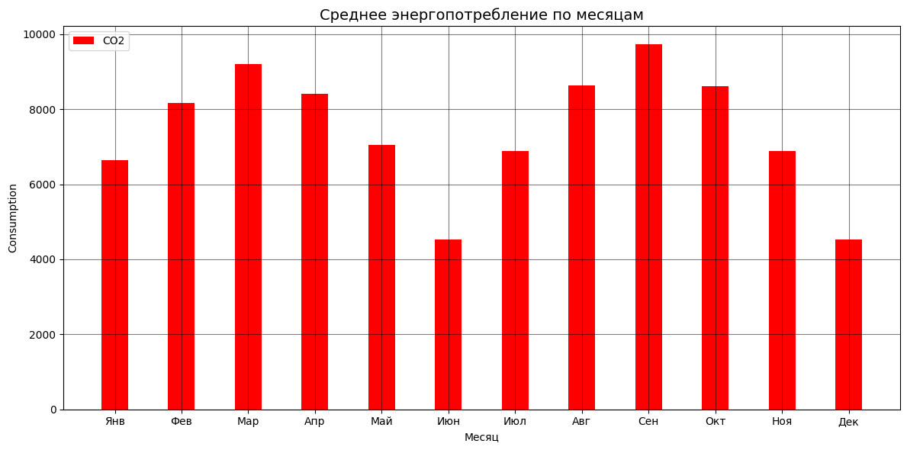

# melekhin-time-series
Репозиторий для курса "Анализ временных рядов". Мелехин Николай Сергеевич

# 1. Описание ВР
Датасет: временной ряд с экологическим, энерегетическими и экономическими факторами для Зимбабве - https://data.world/tadiwachawatama/energyclimatezimbabwe.
Целевая переменная: energy_consumption - объем потребления энергии в сутки
Период: ежедневно с 1.1.2020 до 31.12.2024
Метрики: MAE, SMAPE, MASE, RMSE

# 2. Постановка задачи
Задача: построить прогнозирование потребления энергии на следующий год.

# 3. EDA ВР
EDA выполнен в task_1_timeseries.ipynb

Результаты:

| Признак | Результат |
| ------ | --- | ---- | ----- | ---- | 
| Количество наблюдений | 1826 |
| Пропуски | 0 |
| Дубликаты | 0 | 
| Монотонность | Монотонный |
| Сезонность | Годовая |
| Тренд | Непостоянный, пик в 2023 году |
| Значимые экзогенные факторы | avg_temperature, humidity, urban_population, energy_price |

# 4. Аномалии

Использовались три метода:
- Вероятностное предсказание
- Isolation Forest
- IQR

# Методы анализа ВР

## Статистические методы

| Модель | MAE | RMSE | SMAPE | MASE |
| ------ | --- | ---- | ----- | ---- | 
| MSTL | 1237.01 | 1635.99 | 0.083 | 0.846 |
| CES | 1260.76 | 1682.90 | 0.084 | 0.862 |
| ETS | 1404.47 | 1794.05 | 0.095 | 0.960 |
| HW_Add | 1490.83 | 1856.12 | 0.105 | 1.019 |
| TBATS | 1507.22 | 1814.89 | 0.104 | 1.030 |
| AutoARIMA | 1553.88 | 2057.27 | 0.106 | 1.062 |
| SeasonalNaive | 1553.88 | 2057.27 | 0.106 | 1.062 |
| ARIMA | 1608.02 | 1930.45 | 0.111 | 1.099 |

## ML методы
| Модель | MAE | RMSE | SMAPE | MASE |
| ------ | --- | ---- | ----- | ---- | 
| lasso | 1601.27 | 2128.70 | 0.110 | 1.095 |
| lin_reg | 1601.29 | 2128.72 | 0.110 | 1.095 |
| ridge | 1601.29 | 2128.72 | 0.110 | 1.095 |
| lgbm | 1698.27 | 2253.68 | 0.117 | 1.161 |
| rf | 2347.31 | 3021.17 | 0.166 | 1.605 |

## DL Методы
| Модель | MAE | RMSE | SMAPE | MASE |
| ------ | --- | ---- | ----- | ---- | 
| PatchTST | 1407.11 | 1752.31 | 0.093 | 0.962 |
| LSTM | 1421.62 | 1814.84 | 0.092 | 0.972	|
| NHITS | 1575.20 | 1980.71 | 0.104 | 1.077 |
| TFT | 2317.34 | 2904.46 | 0.160 | 1.584 |
